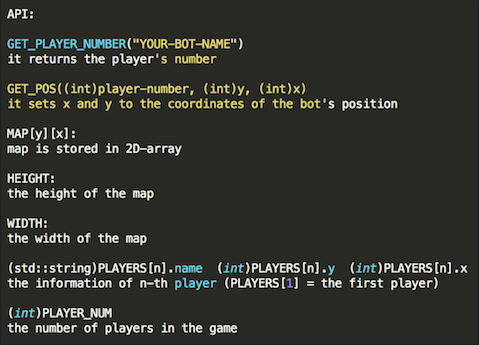

# Ohlone Conqueror's War
<p align="justify">
Ohlone Conqueror’s War is a game based on C++ where students’ program bots to take a virtual field. In this game, they will take cells in a given 2D-array map, and who takes more cells wins.
</p>

## Purpose
* Learning the computer programming basics
* Understanding the AI algorithm basics
* Understanding code optimization
* Improving skills through peer-to-peer evaluation
* Providing an opportunity of experiences other than course materials

## Synopsis
<p align="justify">
During some extraterrestrial exploration, you found another earth like planet! Different countries are looking into capturing this new mineral rich land. You and your elite group members have been selected by the government to ensure that they get the most amount of land. Now, you, as the programmers will come up with an AI that ensures the most land occupation!
</p>

## Rules
### General
1. There can be 2 - 4 players in one game
2. Maps can have obstacles where bots cannot go through
3. Given turns will be bigger than the half of the size of the map
4. Bots are given the block where they start
5. Bots take any block they occupy
6. Bots can take other bots’ blocks

### Movement
1. Bots move at the same time on each turn (Up, Left, Right, Down, or Stay).
2. Bots cannot move to where a block occupied by other bots.
3. Bots cannot move outside the map or to obstacles.
4. Bots cannot move to a same block as another bot.
5. If any bots are not able to move, they will stay and skip the turn.
6. If any bots take more than 2 seconds to make their decisions to move,<br>
 they will stay and skip the turn (to do or not to do! Hamlet Syndrome).

## Implementation
### Map


1. Line 1 indicates how many turns will be in the game
	- Recommended turn is bigger than the half of the map size (x * y)
2. Map will be generated by "." "X" "*"
	- . : Empty blocks which bots can move
	- *: Obstacles where bots cannot move
	- X: Bot start positions (random)
	- Maps must be rectangular form
	- No need to be square
	- To be fair, the map will be mirrored form
	- You can make and test your own maps!

### Function

<p>


</p>



## Installation
**This program is developed on Linux/Unix-based OS.<br>
So, it may have errors on other OS.**

1. Download the repository from Github:
```
git clone https://github.com/mikim42/OCW.git
cd OCW
```
2. Program your bot in ocw_src/players.cpp
	- Player functions should be named player1, player2, player3, and player4
	- You can comment out one of the examples, and code yours
3. Compile the program in OCW directory:
```
make
```
4. Run the program:
```
./ocw <map file> <player1> <layer2> [player3] [player4]
	Player order must be the same as the functions
	At least 2 players needed to start
```

## Collaborators/Sponsors
### Clubs
- DotSlash
- Game Development Club
- Ohlone Engineering Club
- Ohlone College Society of Women Engineers

### Professors
- Suporn Chenhansa
- David Topham
- Ron Sha
- Jim Pham
- Irfan Malik

# Author
* **Mingyun Kim** - [mikim42](https://github.com/mikim42)
